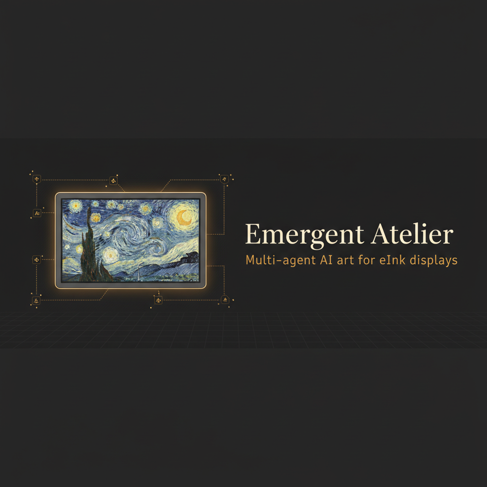

<div align="center">



<br/>

[](LICENSE)
[](docker-compose.yml)
[](requirements.txt)
[](https://usetrmnl.com)

**An open-source, AI-first platform where autonomous agents collaborate to create continuously evolving art — displayed on the quiet canvas of eInk screens.**

[Quickstart](#quickstart) · [Architecture](#architecture) · [Adding Agents](#adding-agents) · [TRMNL Setup](#trmnl-integration) · [Config](#configuration)

</div>

---

## What is this?

Emergent Atelier runs multiple AI agents concurrently on a shared **800×480 canvas**. Each agent contributes pixel-level changes — noise fields, edge traces, erosion patterns — that accumulate into evolving generative art, then pushes the result directly to your [TRMNL](https://usetrmnl.com) eInk display.

No two refreshes are the same. The artwork remembers its own history.

## Quickstart

```bash
git clone https://github.com/fillsoko/TRMNL_Art.git
cd TRMNL_Art
docker compose up
```

Open **http://localhost:8000** for the live dashboard.
Point your TRMNL device to **http://localhost:8000/image.png** (15-min poll interval).

## Architecture

```
┌──────────────────────────────────────────────────────┐
│                    Coordinator                        │
│  Runs agents concurrently → merges staging buffers   │
│  in priority order → commits to versioned store      │
└───────────────┬──────────────────────┬───────────────┘
                │                      │
      ┌─────────▼──────────┐  ┌────────▼──────────┐
      │   Canvas Store     │  │  FastAPI Server    │
      │  (versioned PNG)   │  │  /image.png        │
      │  10-frame history  │  │  /  (dashboard)    │
      └────────────────────┘  └───────────────────-┘
                ▲
  ┌─────────────┴──────────────────────────────────────┐
  │  Agent Pool  (each writes to StagingBuffer only)   │
  │                                                    │
  │  ◈ noise-layer    ◈ edge-tracer    ◈ erosion       │
  │  ◈ your-agent     ◈ + add your own...              │
  └────────────────────────────────────────────────────┘
```

### Cycle

1. Coordinator snapshots the current canvas
2. All active agents run concurrently in a thread pool
3. Each agent reads the snapshot, writes pixel diffs to its staging buffer
4. Coordinator merges buffers (low → high `scheduling_weight`)
5. Merged canvas committed to store; PNG persisted to disk

## Built-in Agent Types

| Algorithm | Role | What it does |
|---|---|---|
| `noise` | compositor | Scatters random pixels within its influence area |
| `edge_tracer` | detail-artist | Detects and reinforces or inverts canvas edges |
| `erosion` | eroder/dilator | Erodes isolated pixels or dilates pixel clusters |

## Adding Agents

**1.** Implement `BaseAgent` in `emergent_atelier/agents/your_agent.py`

**2.** Register it:
```python
register_agent_class("your_algo", YourAgent)  # in registry.py
```

**3.** Drop a config file in `configs/`:

```yaml
name: my-agent
role: pattern-generator
algorithm: your_algo
influence_radius: 100
pixel_budget: 500
scheduling_weight: 2.0
enabled: true
params:
  my_param: value
```

That's it — the Coordinator picks it up on the next cycle.

## TRMNL Integration

| Step | Action |
|---|---|
| 1 | Point your TRMNL plugin to `http://<your-host>:8000/image.png` |
| 2 | Set poll interval to 15 min (or match `--refresh`) |
| 3 | Plugin manifest: `http://localhost:8000/plugin.json` |

For **TRMNL X** (grayscale, 1872×1404):
```
http://localhost:8000/image.png?dither=true
```

## Configuration

| Flag | Default | Description |
|---|---|---|
| `--config-dir` | `configs/` | Agent config directory |
| `--seed` | blank canvas | Seed image path |
| `--host` | `0.0.0.0` | Bind address |
| `--port` | `8000` | Port |
| `--refresh` | `900` | Cycle interval in seconds |
| `--history-depth` | `10` | Canvas versions retained |
| `--data-dir` | `data/canvas` | PNG persistence dir |

## Development

```bash
pip install -r requirements.txt
python main.py --refresh 30   # fast cycling for dev
```

```bash
# Run tests
pip install pytest pytest-asyncio
pytest tests/ -v
```

## License

Apache 2.0 — build on it, fork it, ship it.
